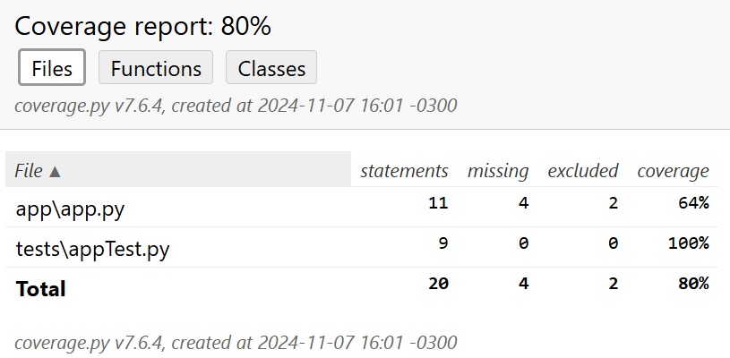

# Testes Unitários de Software

Aplicação base para o desenvolvimento de novos testes unitários com PyUnit.

## A Cobertura de Testes

A cobertura de testes, também conhecida como cobertura de código, consiste na razão entre o número de linhas executadas por ao menos um caso de teste e o número total de linhas existentes:

```
cobertura de teste = linhas de código executadas / número total de linhas
```

A cobertura do teste é frequentemente utilizada para avaliar a qualidade de um conjunto de testes.
Se a cobertura do teste for baixa, por exemplo, 5%, é um indicador de que você não está testando o suficiente, ao passo que 100% de cobertura não implica necessariamente em uma alta qualidade, é preciso avaliar os cenários individualmente.

## Identificando a Cobertura de Testes da Aplicação

1. Instalar as dependências necessárias:

```
$ pip install flask
$ pip install coverage
```

2. Executar o módulo coverage para gerar os dados:

```
$ python -m coverage run -m unittest -v tests/appTest.py
```

3. Transformar os dados gerados em um relatório:

```
$ python -m coverage report
```

Saída esperada:

```
Name               Stmts   Miss  Cover
--------------------------------------
app\app.py            11      4    64%
tests\appTest.py       9      0   100%
--------------------------------------
TOTAL                 20      4    80%
```

4. É possível obter uma visualização mais amigável a partir do relatório em HTML:

```
$ python -m coverage html
```

Saída esperada:

```
Wrote HTML report to htmlcov\index.html
```

5. Ao abrir o arquivo index.html da pasta htmlcov, ele se parecerá com o seguinte:
   
6. É possível navegar pela página para identificar as linhas fora da cobertura de testes:
   

## Exercício Proposto

Aumentar a cobertura dos testes para 100%, a partir do desenvolvimento de novos casos de teste.

## Executando a aplicação

```
$ python app/app.py run
```

A aplicação responderá em duas rotas na web:

http://localhost:5000/health-check

http://localhost:5000/hello?name=guijac
